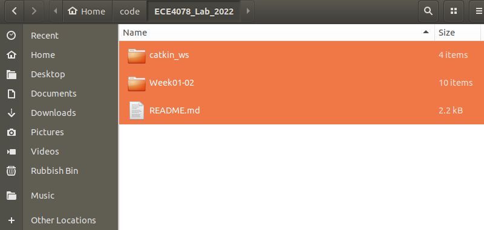

# Milestone 1: Teleoperating the Robot with your Keyboard

We will be using the [PenguinPi robot](https://cirrusrobotics.com.au/products/penguinpi/) in the [Gazebo simulator](http://gazebosim.org/) and operating it in a physical arena for our lab project.

This first milestone will allow you to become more familar with the simulator environment, the PenguinPi robot and some useful controls.

## Objective 1: Setting up your Environment
Team members(s) attending the lab session in person should test using the physical robot, while those attending the lab sessions remotely will need to set up the simulator enviroment. Whether working in person or remotely, all code development and testing are recommended to be done within the virtual machine (VM) provided.

1. The [Installation Guide](InstallationGuide.md) provides detailed instructions on installing the VM, and then setting up and testing the simulator environment, or connecting to the physical robot.
2. Within your VM, clone this repo by typing ```git clone https://github.com/calvong/ECE4078_Lab_2022``` inside your terminal.
3. Navigate to this week's lab by typing the commmands ``` cd ECE4078_Lab_2022/Week01-02/```

## Objective 2: Implement Keyboard Teleoperation

You will implement keyboard teleoperations by editing [line 137 - 150 of operate.py](operate.py#L137).

You will also need [the pics folder for painting the GUI](pics/), and [the util folder for utility scripts](util/), already contained within the repo.

- **Using Simulator Environment**
  - You can run [operate.py](operate.py) by typing ```python3 operate.py``` in a terminal. You will need to launch the simulator environment first.
This command will open a GUI with the robot's camera view shown.
- **Using Physical Robot**
  - If you are operating a physical robot, you will need to include flag for its IP address and port in your command (see [Installation Guide](InstallationGuide.md) for details).

**Note:** In order to run ```python3 operate.py```, your terminal needs to be in the directory where [operate.py](operate.py) is (eg. ```ECE4078_Lab_2022/Week01-02/```)

**You don't have to use the provided scripts.** Feel free to be creative and write your own scripts for teleoperating the robot with keyboard.

---
## Marking Instructions 
You will need to demonstrate your teleoperation in both the simulation and the physical robot during the Week 3 lab session.
- Live demo in the simulator (by setting up the sim environment and completing [operate.py](operate.py)):
  - Drive foward +20pt
  - Drive backward +20pt
  - Turn left +20pt
  - Turn right +20pt
- Live demo with the physical robot (+20pt)

**Please familiarise yourselves with these steps to ensure the demonstrators can finish marking your team in the allocated time**
- [In-person marking steps](#in-person-marking)
- [In-person marking checklist](#in-person-marking-checklist)
- [Zoom marking steps](#zoom-marking)
- [Zoom marking checklist](#zoom-marking-checklist)

Each team will have a **STRICT** time limit get marked, 20min for the simulator demo and 10min for the physical robot demo, according to this [marking schedule](https://docs.google.com/spreadsheets/d/14GB1km85aYwIS4eiDUr7CUI0OCfg7yIZ2AUgJ6iAMlA/edit?usp=sharing). You may open up the marking checklist, which is a simplified version of the following steps to remind yourself of the marking procedures. 

**Note:** For the remote students (Lab 6), you will only need to demonstrate yours in the simulator.

### In-person marking
#### Step 1:
**Do this BEFORE your lab session**
Zip your whole Week01-02 and catkin_ws folders (see the picture below) to the Moodle submission box (according to your lab session). Each group only needs one submmission. This submission is due by the starting time of the lab session, which means you should **submit your script BEFORE you come to the lab**. 

**Tip:** You may also include a text file in the zip file with a list of commands to use, if you don't know all the commands by heart.




#### Step 2: 
**Do this BEFORE the demonstrator come to mark your team**

1. Close all the windows/applications on your Ubuntu environment

2. Use any team member's account to login Moodle in the Ubuntu environment (VM/native/WSL2, whichever one you use) and nagviate to the M1 submission box, so that you are ready to download your submitted code when the demonstrator arrives

3. Have an **empty** folder named "LiveDemo" ready at the Ubuntu home directory, ie. it is at ```~/LiveDemo/```. This folder should remain open at all time during marking (Does not apply to WSL2 users)

4. **[ROBOT ONLY]** Please turn on your robot before the demonstrator comes to you. DO NOT connect to its hotspot yet 

#### Step 3:
**During marking**
1. When the demonstrator start to mark you, download your submitted zip file from Moodle and unzip its content to the "LiveDemo" folder

2. **[SIM ONLY]** Open a terminal and type ```source ~/LiveDemo/catkin_ws/devel/setup.bash```

3. **[SIM ONLY]** Launch the simulator with ```roslaunch penguinpi_gazebo ECE4078.launch```

4. Open another terminal, or new tab in the existing terminal, navigate to the "Week01-02" folder which contains the operate.py script

5. Run the script with either ```python3 operate.py``` [for sim] or ```python3 operate.py --ip 192.168.50.1 --port 8080``` [for robot]

6. Demonstrate the teleoperation and good luck!
---

### In-person marking checklist
**BEFORE the lab session**
- [ ] Submit your code to Moodle

**BEFORE the marking**
- [ ] Close all programs and folders
- [ ] In Ubuntu, login Moodle and navigate to the submission box
- [ ] Open an empty folder named "LiveDemo" (located at ```~/LiveDemo/```)
- [ ] Turn on the robot (DO NOT connect to its hotspot yet)

**During the marking**
- [ ] Demonstrator will ask you to download your submission and unzip it to "LiveDemo"
- [ ] **[SIM ONLY]** ```source ~/LiveDemo/catkin_ws/devel/setup.bash```
- [ ] **[SIM ONLY]** ```roslaunch penguinpi_gazebo ECE4078.launch```
- [ ] Run the operate.py script
- [ ] Demonstrate the teleoperation and good luck!

---
### Zoom marking
#### Step 1:
**Do this BEFORE your lab session**
Zip your whole Week01-02 and catkin_ws folders (see the picture below) to the Moodle submission box (according to your lab session). Each group only needs one submmission. This submission is due by the starting time of the lab session, which means you should **submit your script BEFORE you come to the lab**. 

**Tip:** You may also include a text file in the zip file with a list of commands to use, if you don't know all the commands by heart.


You will also need to install ```screenkey``` in  your Ubuntu. You can do so with ```sudo apt-get install screenkey```. We use this software to monitor your key press event. You can try this out by typing ```screenkey``` in the terminal, and then just type something. A bar should show up at the bottom of your screen showing what keys you have pressed. You can stop screenkey with this command ```pkill -f screenkey```.


#### Step 2: 
**Do this BEFORE the demonstrator come to mark your team**

1. Close all the windows/applications on your Ubuntu environment

2. Use any team member's account to login Moodle in the Ubuntu environment (VM/native/WSL2, whichever one you use) and nagviate to the M1 submission box, so that you are ready to download your submitted code when the demonstrator arrives

3. Have an **empty** folder named "LiveDemo" ready at the Ubuntu home directory, ie. it is at ```~/LiveDemo/```. This folder should remain open at all time during marking (Does not apply to WSL2 users)

4. If you have a dual monitor setup, please disconnect one of them. You are only allowed to use a single monitor during marking

#### Step 3:
**During marking**
1. Please make sure only one display is on for the driver during the live demo. You will asked to show your display setting with:
- Windows: Settings -> System -> Display
- Linux: xrandr | grep connected | wc -l (type this in terminal and then count the lines returned)
- Mac: System Preferences -> Displays

2. When the demonstrator start to mark you, download your submitted zip file from Moodle and unzip it to the "LiveDemo" folder

3. Open a terminal and type ```screenkey```

4. type ```source ~/LiveDemo/catkin_ws/devel/setup.bash```

5. Launch the simulator with ```roslaunch penguinpi_gazebo ECE4078.launch```

6. Open another terminal, or new tab in the existing terminal, navigate to the "Week01-02" folder which contains the operate.py script

7. Run the script with ```python3 operate.py```

8. Demonstrate the teleoperation and good luck!

---
### Zoom marking checklist
**BEFORE the lab session**
- [ ] Submit your code to Moodle
- [ ] Install ```screenkey``` in Ubuntu 

**BEFORE the marking**
- [ ] Close all programs and folders
- [ ] In Ubuntu, login Moodle and navigate to the submission box
- [ ] Open an empty folder named "LiveDemo" (located at ```~/LiveDemo/```)
- [ ] Only use a **single monitor** during marking

**During the marking**
- [ ] Show that you are only using a single monitor
- [ ] Demonstrator will ask you to download your submission and unzip it to "LiveDemo"
- [ ] Open a terminal and start ```screenkey```
- [ ] ```source ~/LiveDemo/catkin_ws/devel/setup.bash```
- [ ] ```roslaunch penguinpi_gazebo ECE4078.launch```
- [ ] Run the operate.py script
- [ ] Demonstrate the teleoperation and good luck!

